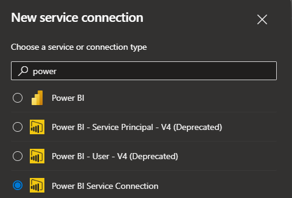

# PowerBI Deployment Example

Simple example of how to setup a deployment pipeline for Power BI dataset(s) from pbix file stored in git to Power Bi Service.

## Pre-reqs for this to run

This example assumes that you have a Azure DevOps project at hand as well as one custom action installed in the Azure DevOps organization your project is created within.

- Access to Azure DevOps project to run pipeline.
- [Power BI Actions](https://marketplace.visualstudio.com/items?itemName=maikvandergaag.maikvandergaag-power-bi-actions) externsion installed in your Azure DevOps Organization.
- Power BI Service Connection configured in Azure DevOps.
- Service account details available (Azure AD account) during configuration of Power BI Service Connection has been granted admin privilages on workspace.

## General setup

This describes the general configuration required before pipeline run's in Azure DevOps can be completed successfully.

### Create Service Connection for Power BI in Azure DevOps

In your Azure DevOps project start by creating a new Service Connection with connection type `Power BI Service Connection`. You will fins the `New Service Connection` button by navigating to Project `Settings -> Service Connections`.



In this example I have used `Username/Password` and after that the below settings to configure the service connection:

- Organization type = `Commercial (Public)`
- Username = `email_address_of_serviceaccount@somecompany.com`
- Password = [your password]
- Service connection name = `PBI_SC_PRODUCTION`

When done click `Save`

### Grant service account access

The service account used when settings up the `Service Connection` in the previous step need to be granted admin privilages in all the workspaces you want to deploy reports/datasets to.

### Add PBIX files to git repo

You need to ahve a t least one pbix available in your git repo. It will be assumed that the PBIX files are saved in a folder named `power-bi` in the root of the git repo. In this example the pbix file also has one paramter configured called `paramServer` which is used to set the connectionstring used by the report.

## Azure DevOps pipeline setup

### Build stage

Our build stage will copy any pbix file added to the `demo/power-bi` folder to our artifact and publish it.

```yml
name: pipeline-pbix

parameters:
  - name: tenantId #Only needed if you want to configure log export
    type: string
  - name: subscriptionId #Only needed if you want to configure log export
    type: string
  - name: serverUrl
    type: string
  - name: serviceAccountUserName
    type: string
  - name: serviceAccountPassword
    type: string
  - name: logAnalyticsWorkspaceRgName #Only needed if you want to configure log export
    type: string
  - name: logAnalyticsWorkspaceName #Only needed if you want to configure log export
    type: string

trigger:
  branches:
    include:
      - master

variables:
  - name: pbiServiceConnectionName
    value: "PBI_SC_PRODUCTION"
  - name: pbiWorkspaceName
    value: "demo-workspace-1"
  - name: pbiWorkspaceId
    value: "82db5f5a-de46-4ab8-a4fa-3c890ebab893"
  - name: pbiGatewayId
    value: "97401768-9a0a-4973-a0e6-c60ed61adab4"

stages:
  - stage: build
    displayName: Build
    jobs:
      - job: Build
        steps:
          - task: CopyFiles@2
            displayName: "Copy PBIX resources"
            inputs:
              SourceFolder: "demo/power-bi"
              Contents: "**"
              TargetFolder: "demo/pbix-files"
              flattenFolders: false

          - task: CopyFiles@2
            displayName: "Copy PowerShell scripts"
            inputs:
              SourceFolder: "demo/ps"
              Contents: "*.ps1"
              TargetFolder: "demo/ps"
              flattenFolders: false

          - task: PublishBuildArtifacts@1
            displayName: Publish Artifact
            inputs:
              ArtifactName: demo-artifact
```

### Deployment stage

As a starting point we use the `Power Bi Actions` task to publish the pbix file to the Power Bi Service and spcified workspace.

```yml
- task: PowerBIActions@5
  displayName: "Publish PBIX file to workspace"
  inputs:
    PowerBIServiceEndpoint: $(pbiServiceConnectionName)
    Action: "Publish"
    WorkspaceName: $(pbiWorkspaceName)
    PowerBIPath: "${{ Pipeline.Workspace }}/demo-artifact/INDE_RESOURCES/Sales"
    Create: false
```

To be able to configure settings and values for parameters we need to take ownership of the published pbix file. We can do that using the `Power Bi Actions` task again.

_Please note that the example below will update this parameter on all dataset's present in the workspace._

```yml
- task: PowerBIActions@5
  displayName: "Take ownership of files"
  inputs:
    PowerBIServiceEndpoint: $(pbiServiceConnectionName)
    Action: "TakeOwnership"
    WorkspaceName: $(pbiWorkspaceName)
    UpdateAll: true
```

Next we will change the value for the dataset parameter named `paramServer`. This action is also available in the `Power Bi Action` extension. The actual server url will be provided in the pipeline parameter called `serverUrl`.

_Please note that the example below will update this parameter on all dataset's present in the workspace. If you want to update a specific dataset only that is also possible but not shown in this example. More infromation can be found [here](https://github.com/maikvandergaag/msft-extensions/blob/145fd79f04928a052857ab56b05da83ba67a1133/azuredevops/powerbiactions-new/powerbiactionsnew/ps_modules/PowerBi/powerbi.psm1#L243)._

```yml
- task: PowerBIActions@5
  displayName: "Update dataset parameters"
  inputs:
    PowerBIServiceEndpoint: $(pbiServiceConnectionName)
    Action: "UpdateParameters"
    UpdateAll: true
    WorkspaceName: $(pbiWorkspaceName)
    ParameterInput: "[{'name' : 'paramServer', 'newValue' : '${{ parameters.serverUrl }}'}]"
```

In the following two steps we will need to use custom PowerShell script. For them to run without issues we need to make sure that PowerShell module `MicrosoftPowerBIMgmt` is installed on the build agent.

```yml
- task: PowerShell@2
  displayName: "Install MicrosoftPowerBIMgmt module"
  inputs:
    targetType: "inline"
    script: |
      If(-not(Get-InstalledModule MicrosoftPowerBIMgmt -ErrorAction silentlycontinue)){
            Install-Module -Name MicrosoftPowerBIMgmt -Scope CurrentUser -Force
      }
```

The next step is only required if your dataset requires a `On-premise data gateway` to connect to the data source. If not you can skip this next step.

There is no action within the `PowerBiActions` actions to bind a dataset to a gateway so we need to run a custom PowerShell script to accomplish this.

```yml
- task: PowerShell@2
  displayName: "Bind datasets to gateway"
  inputs:
    filePath: "path/to/demo-artifact/ps/pbi-bind-datasets-to-gateway.ps1"
    arguments: "-groupId '$(pbiWorkspaceName)' -gatewayId '${{ variables.powerBIGatewayId }}'"
  env:
    saUserName: "${{ parameters.serviceAccountUserName }}"
    saPassword: "${{ parameters.serviceAccountUserPassword }}"
```

The next task will configure export of logs to Azure Log Analytics. To accomplish this we will again use a custom PowerShell script. Unfoutunatly this operation is somewhat undocumented and the current version of the script only supports configuration of Power BI workspaces hosted in Azure North Europe data center. _If you run your broswer dev tools you should be able to easily find the url used by your Power BI Tenant and modify the script using it_

```yml
- task: PowerShell@2
  continueOnError: true
  displayName: "Configure export of PBI Workspace logs to Azure Log Analytics"
  inputs:
    filePath: "path/to/demo-artifact/ps/pbi-configure-logging.ps1"
    arguments: "-resourceGroup ${{ parameters.logAnalyticsWorkspaceRgName }} -laWorkspaceResourceName ${{ parameters.logAnalyticsWorkspaceName }}  -subscriptionId ${{ parameters.subscriptionId }} -tenantId ${{ parameters.tenantId }} -pbiGroupId $(pbiWorkspaceId)"
```

Last but not least we will trigger a refresh of the dataset. We can use a built in action to accomplish this. _This step is of course not needed if you have a dataset build using Direct Query_.

```yml
- task: PowerBIActions@5
  continueOnError: true
  displayName: "Refresh dataset"
  inputs:
    PowerBIServiceEndpoint: $(pbiServiceConnectionName)
    Action: "DataRefresh"
    WorkspaceName: "$(pbiWorkspaceName)"
    DatasetName: "demo-dataset"
```
